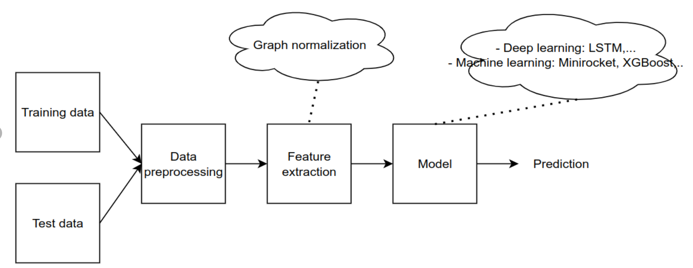

Mouse dynamic authentication is an innovative approach leveraging the unique patterns and behaviors exhibited by individuals while using a computer mouse. This technology analyzes various facets of interaction, including cursor movement, click patterns, speed, and acceleration, to create a distinct biometric profile for users.
Here is an overview of the processing pipeline:

